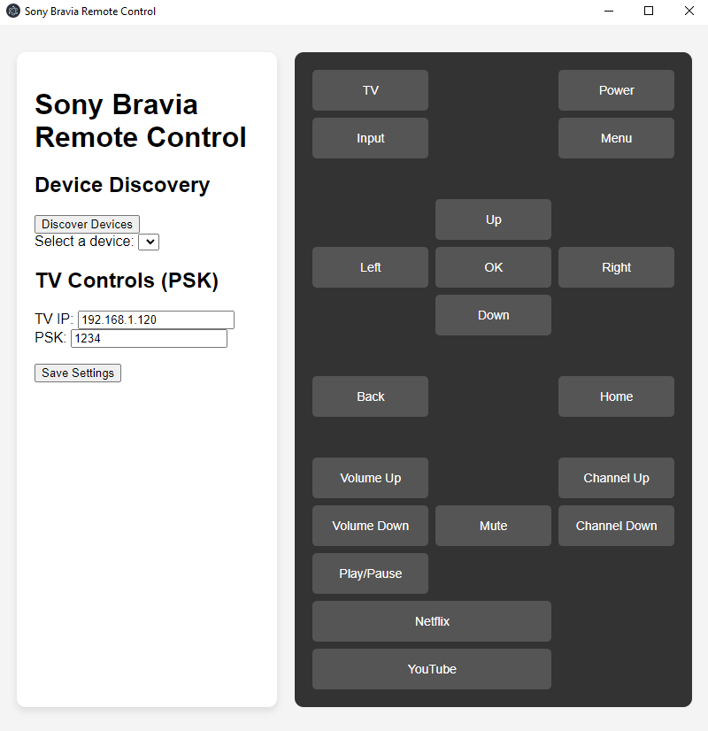

# Sony Bravia Remote Control

A simple Electron-based remote control application to interact with Sony Bravia TVs over a local network using the ScalarWebAPI and IRCC commands. The app allows users to control TV functionalities like power, volume, channels, input, and media controls through an intuitive remote interface. Built specifically for Tobii Dynavox who use TD Control for controlling the Operating System with only their eyes.

## Features

- **Device Discovery**: Automatically discover Sony Bravia TVs on the local network.
- **IRCC Commands**: Send Infrared-like remote control commands via Sony’s IRCC API.
- **Customizable Settings**: Save TV IP and PSK (Pre-Shared Key) for easy reconnection.
- **Remote Control UI**: Intuitive on-screen remote to control TV functions.
- **Platform**: Works on Windows.

## Screenshots



## Installation

1. **Clone the repository:**

   ```bash
   gh repo clone jpitty03/BraviaRemoteControl
   cd BraviaRemoteControl
   ```

2. **Install Dependencies:**

   Make sure you have [NodeJs](https://nodejs.org/) installed.
   ```bash
   npm install
   ```

3. **Run the app:**

   Make sure you have Node.js installed.
   ```bash
   npm start
   ```

## Usage

1. **Device Discovery:**  Click on Discover Devices to automatically find your Sony Bravia TV on the network.
1. **Set TV IP and PSK:**  Manually enter your TV’s IP address and PSK (Pre-Shared Key) if it is not automatically discovered. Go here to set up PSK for Bravia TVs. [How to Configure Pre-Shared Key](https://pro-bravia.sony.net/resources/software/bravia-signage/user-guide/chapter_1/#configure-pre-shared-key)
2. **Save Settings:**  Save your TV IP and PSK for future use by clicking Save Settings.
2. **Control Your TV:**  Use the remote buttons to interact with your Sony Bravia TV. Commands like Power, Volume, Channel, and Input are supported.

## Building
Using this the workflow above, GitHub will build your app every time you push a commit.

## Releasing
When you want to create a new release, follow these steps:

1. Update the version in your project's package.json file (e.g. 1.2.3)
2. Commit that change (git commit -am v1.2.3)
3. Tag your commit (git tag v1.2.3). Make sure your tag name's format is v*.*.*. Your workflow will use this tag to detect when to create a release
4. Push your changes to GitHub (git push && git push --tags)
After building successfully, the action will publish your release artifacts. By default, a new release draft will be created on GitHub with download links for your app. If you want to change this behavior, have a look at the electron-builder docs.

## License
This project is licensed under the MIT License - see the LICENSE file for details.
